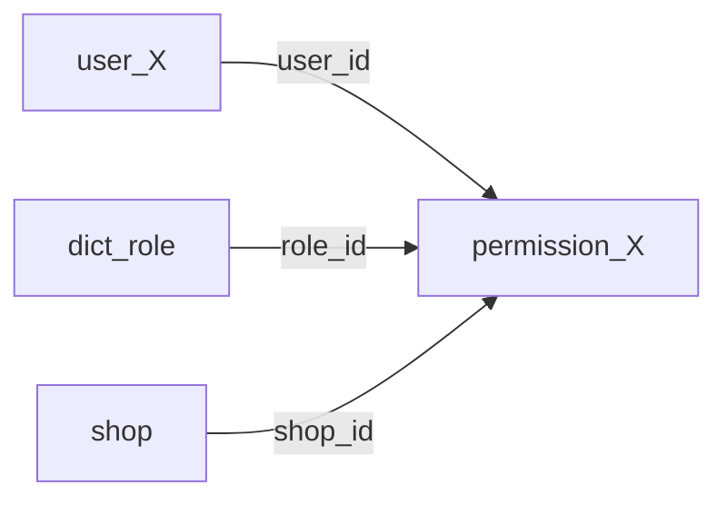

# BitGoPlus开发文档

**Author**：[汪洛飞](https://github.com/wlf728050719)  
**Email**：[18086270070@163.com](mailto:18086270070@163.com)  
**GitHub Repository**：[GitHub 仓库](https://github.com/wlf728050719/BitGoPlus)

# 目录

- [项目约定](#项目约定)
- [数据库说明](#数据库说明)
- [代码约定](#代码约定)
- [风格规范](#风格规范)
- [注意事项](#注意事项)

***

# 项目约定

1. 同一手机号/同一邮箱只能注册唯一账号，注册后对应验证方式设置为true，注册默认添加角色customer，tenantId = userId
2. 同一账号可以有多个身份，权限由身份+租户ID确认,注册完毕后可通过应聘，开店等方式获取新的角色和权限
3. 找回密码/修改密码 可使用验证后的任意一种个人信息加验证码修改

***

# 数据库说明

数据库无物理外键，主键只允许使用单主键
非字典项表主键为雪花算法生成的id，且不允许使用其他unique索引，约束均需要使用代码实现

## 整体结构

## 用户表(`user`)

### db_user.user_X  

| 列名                          | 类型           | 默认值              | 说明                       |
|-----------------------------|--------------|------------------|--------------------------|
| `user_id`                   | bigint       | 无                | 用户ID（雪花ID）               |
| `username`                  | varchar(50)  | 无                | 用户名                      |
| `real_name`                 | varchar(50)  | NULL             | 真实姓名                     |
| `real_name_verify`          | tinyint      | 0                | 验证标志（0-未验证，1-已验证）        |
| `nickname`                  | varchar(50)  | NULL             | 昵称                       |
| `password`                  | varchar(100) | 无                | 加密后的密码                   |
| `avatar`                    | varchar(255) | NULL             | 头像URL                    |
| `birth_date`                | date         | NULL             | 出生日期                     |
| `birth_date_verify`         | tinyint      | 0                | 验证标志（0-未验证，1-已验证）        |
| `phone`                     | varchar(20)  | NULL             | 手机号                      |
| `phone_verify`              | tinyint      | 0                | 验证标志（0-未验证，1-已验证）        |
| `email`                     | varchar(100) | NULL             | 邮箱                       |
| `email_verify`              | tinyint      | 0                | 验证标志（0-未验证，1-已验证）        |
| `qq`                        | varchar(15)  | NULL             | QQ号                      |
| `qq_verify`                 | tinyint      | 0                | 验证标志（0-未验证，1-已验证）        |
| `wechat`                    | varchar(50)  | NULL             | 微信号                      |
| `wechat_verify`             | tinyint      | 0                | 验证标志（0-未验证，1-已验证）        |
| `gender`                    | tinyint      | 0                | 性别（0-未知，1-男，2-女）         |
| `id_card`                   | varchar(18)  | NULL             | 身份证号                     |
| `id_card_verify`            | tinyint      | 0                | 验证标志（0-未验证，1-已验证）        |
| `status`                    | tinyint      | 1                | 状态(1-正常,0-禁用)            |
| `create_time`               | datetime     | CREATE_TIMESTAMP | 创建时间                     |
| `update_time`               | datetime     | UPDATE_TIMESTAMP | 更新时间                     |
| `last_login_time`           | datetime     | NULL             | 上次登录时间                   |
| `last_login_ip`             | varchar(50)  | NULL             | 最后登录IP                   |
| `last_password_change_time` | datetime     | NULL             | 上次修改密码时间                 |
| `lock_flag`                 | tinyint      | 0                | 锁定标志（0-未锁定，1-已锁定）        |
| `del_flag`                  | tinyint      | 0                | 删除标志（0-未删除，1-已删除）        |

### 物理约束

- 主键：`user_id`

### 逻辑约束
- 全部分表`username`唯一
- 全部分表(`phone`,`phone_verify`=1)唯一
- 全部分表(`email`,`email_verify`=1)唯一
- 全部分表(`qq`,`qq_verify`=1)唯一
- 全部分表(`wechat`,`wechat_verify`=1)唯一
- 全部分表(`id_card`,`id_card_verify`)唯一

## 角色表

### db_user.dict_role

| 列名            | 类型           | 默认值   | 说明                                        |
|---------------|--------------|-------|-------------------------------------------|
| `role_id`     | int          | 无     | 角色ID                                      |
| `role_code`   | varchar(20)  | 无     | 角色编码(admin, customer, shopkeeper, clerk等) |
| `description` | varchar(200) | NULL  | 角色描述                                      |
| `del_flag`    | tinyint      | 0     | 删除标志（0-未删除，1-已删除）                         |

### 物理约束

- 主键：`role_id`
- 唯一索引：`role_code`

## 权限表

### db_user.permission_X

| 列名            | 类型       | 默认值               | 说明                 |
|---------------|----------|-------------------|--------------------|
| `user_id`     | bigint   | 无                 | 用户ID               |
| `role_id`     | int      | 无                 | 角色ID               |
| `tenant_id`   | bigint   | NULL              | 租户ID(店铺ID)         |
| `create_time` | datetime | CURRENT_TIMESTAMP | 创建时间               |
| `update_time` | datetime | UPDATE_TIMESTAMP  | 更新时间               |
| `del_flag`    | tinyint  | 0                 | 删除标志(0-未删除, 1-已删除) |

### 逻辑约束

- 全部分表(`user_id`,`role_id`,`tenant_id`,`del_flag`=0)唯一
- `user_id` -> `db_user.user_X.user_id`
- `role_id` -> `db_user.dict_role.role_id`
- `tenant_id` -> `db_product.shop.shop_id`

## 店铺表

### db_product.shop

| 列名                 | 类型           | 默认值               | 说明                 |
|--------------------|--------------|-------------------|--------------------|
| `shop_id`          | bigint       | 无                 | 店铺ID               |
| `shop_name`        | varchar(50)  | 无                 | 店铺名称               |
| `logo`             | varchar(255) | NULL              | 店铺logo             |
| `description`      | varchar(500) | NULL              | 店铺描述               |
| `contact_phone`    | varchar(20)  | NULL              | 联系电话               |
| `address`          | varchar(200) | NULL              | 店铺地址               |
| `business_license` | varchar(100) | NULL              | 营业执照号              |
| `sort_order`       | int          | 0                 | 排序                 |
| `status`           | tinyint      | 1                 | 状态（1-正常，0-禁用）      |
| `create_time`      | datetime     | CURRENT_TIMESTAMP | 创建时间               |
| `update_time`      | datetime     | UPDATE_TIMESTAMP  | 更新时间               |
| `del_flag`         | tinyint      | 0                 | 删除标志(0-未删除, 1-已删除) |

### 物理约束

- 主键：`shop_id`

***

# 代码约定

- [全局](#全局)
- [Controller层](#Controller层)
- [Mapper层](#Mapper层)
- [Manager层](#Manager层)
- [Service层](#Service层)

## 全局

### pojo类

1. 所有实体类和常量类必须定义在common-core模块中(否则容易出现循环依赖问题)
2. 持久层类均与PO或DictItem结尾，且要求属性与数据库字段一一对应(统一命名规范)
3. 多表组合数据实体类放dto中
4. 如果dto对象直接与po交互，dto对象转po对象方法必须定义在dto对象中，且方法固定为newXX明确为两个不同对象,以及需要有po生成dto的构造方法(使po专注于与数据库交互)

### 异常

1. 除了业务异常以及继承类msg使用中文，其余使用英文(用户友好)
2. 各模块内部exception定义在各自模块中，继承BizException或SysException(方便ExceptionHandler统一处理)

### 其他

1. Manager层负责可复用业务，Service层实现具体业务，原则上每个服务只能有一个service，且其函数与对应接口同名(分层解耦)
2. 通过@Cacheable注解value为命名空间,统一使用KeyGenerator进行管理。使用RedisTemplate则需要统一使用定义在RedisKey文件中的String.format/String形式(防止魔法值，且相同类型缓存使用类似键生成方式方便查询)

## Controller层

1. Controller层负责参数的校验，以及将Service层的输出封装为R
2. 所有接口传入对象只能为dto中定义对象,且只有dto中对象添加jsr校验(使参数校验部分统一由Controller负责)
3. 每个服务RPC接口均命名为APIController且统一以/api路径开头，且该Controller不开启jsr校验以及身份识别(安全配置开放为内部端点,统一鉴权)
4. 非APIController中对外开放接口使用/服务/open开头

## Mapper层

1. Mapper层负责直接操作数据库，其方法名应明确指出操作对象条件
2. Mapper层使用BaseMapper<PO类>，可以直接从数据库中获取DTO类，但DTO类无法使用Mybatis Plus特性，但除了查询其余操作必须使用PO类(优化查询)
3. del_flag = 1的数据视为删除(非主键查询时需要添加undeleted),lock_flag = 1的数据视为冻结(非主键查询添加available)
4. 通过id主键获取的数据一定唯一或空，不需要添加undeleted或available

## Manager层

1. 命名为持久层对象去掉尾缀后添加Manager,对应实现类再添加Impl。
2. manager层不对mapper的异常进行特殊处理，抛出统一捕获(便于Service层回滚)

## Service层

1. 所有service层涉及操作manager的方法均需要添加@Transactional(防止数据库脏数据)
2. 业务层业务成功返回R.ok,其余用户异常操作时（如未授权访问/参数校验错误）均抛出异常(事务回滚)

***

# 风格规范

## checkstyle使用方法:

### 安装和配置

idea安装`CheckStyle-IDEA`插件以及`Adapter for Eclipse Code Formatter`插件

`工具`->`Checkstyle`->配置检查规则xml文件为根目录下/style/alibaba.xml

（style/suppressions.xml中为checkstyle跳过检查文件，当前配置为跳过所有资源文件，可自行配置，代码中风格问题可SuppressWarning注解抑制风格问题）

`其他工具`->`Adapter for Eclipse Code Formatter`->`Use Eclipse's Code Formatter`->配置xml文件为根目录下/style/ecipse-codestyle.xml

### 格式检查

#### 1.直接使用

idea安装后左下角有checkstyle按钮，选择配置的代码风格对全局扫描即可

#### 2.maven使用

终端输入 mvn checkstyle:check -D checkstyle.skip=false
(文件长度问题无法使用suppressWarning解决，设置级别为warning，测试环境是否配置成功方法可尝试注释掉alibaba.xml第19行，输入上述命名报错则表明配置正确，未注释情况下build seccess)

### 自动规范

idea已经自动整合规范文件 ctrl+alt+l即可规范选中代码或右键项目->重新设置代码格式规范整个项目

***

# 注意事项

## 用户服务

1. 用户登录校验优先使用缓存数据，当用户数据更新时需要及时更新缓存
